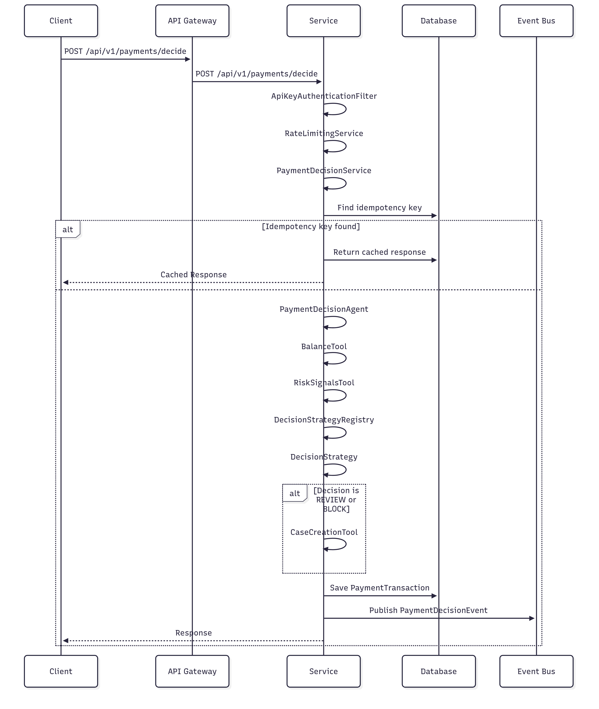

# PayNow Agent Assist

A banking payment decision system with AI agent assistance, built with Spring Boot. This project simulates a payment flow where a user initiates a payment and an agentic AI assists with checks and recommendations.

## How to Run Locally

You can run the application using either Maven or Docker.

### Using Maven

1.  **Build the application:**

    ```bash
    mvn clean install
    ```

2.  **Run the application:**

    ```bash
    java -jar target/agent-assist-0.0.1-SNAPSHOT.jar
    ```

### Using Docker

1.  **Build the Docker image:**

    ```bash
    docker build -t paynow-agent-assist .
    ```

2.  **Run the Docker container:**

    ```bash
    docker run -p 8080:8080 paynow-agent-assist
    ```

## Architecture Diagram



## What I Optimized

- **Asynchronous Tool Execution:** The agent's tools (`BalanceTool`, `RiskSignalsTool`, `CaseCreationTool`) are executed asynchronously using `CompletableFuture`. This allows for parallel execution of I/O-bound operations, which significantly reduces the overall response time.
- **Performance Monitoring:** I've implemented a `PerformanceMonitoredPaymentDecisionService` decorator that uses Micrometer to collect performance metrics for the core business logic. This allows for easy identification of performance bottlenecks.
- **Connection Pooling:** The application uses a connection pool to manage database connections, which reduces the overhead of establishing new connections for each request.
- **Efficient Caching:** The application uses an in-memory cache for API keys, which reduces the need to query the database for every request.

## Trade-offs I Made

- **In-Memory Database:** For simplicity and ease of setup, the application uses an in-memory H2 database. For a production environment, a persistent database like PostgreSQL or MySQL would be a better choice.
- **In-Memory Rate Limiting:** The rate limiting service uses an in-memory store for buckets. In a distributed environment, a distributed cache like Redis would be needed to ensure consistent rate limiting across multiple instances.
- **Simulated Event Bus:** The `EventPublisher` simulates an event bus by logging events to the console. In a real-world scenario, this would be replaced with a proper message broker like Kafka or RabbitMQ.
- **Simple Metrics vs Full Observability Stack:**
  The application uses a custom metrics endpoint and Spring Actuator.
  This approach is lightweight and appropriate for the scale of this project.

## POST /payments/decide Sample cURL

```bash
curl -X POST 'http://localhost:8080/api/v1/payments/decide' \
--header 'X-API-Key: paynow-api-key-test' \
--header 'Content-Type: application/json' \
--data-raw '{
    "customerId": "c_12345",
    "amount": 100.00,
    "currency": "USD",
    "payeeId": "p_67890",
    "idempotencyKey": "idem_12345"
}'
```

## Brief Notes

### a. Performance

- **p95 Latency:** To optimize for p95 latency, I've implemented several techniques:
  - **Pre-validation:** The controller performs basic validation of the request before passing it to the service layer. This prevents unnecessary processing of invalid requests.
  - **Asynchronous Tools:** As mentioned above, the agent's tools are executed asynchronously to reduce I/O wait times.
  - **Caching:** The application uses caching for API keys and idempotency checks to reduce database lookups.

### b. Security

- **PII (Personally Identifiable Information):** The `PiiMaskingUtil` is used to mask sensitive information like customer IDs in the logs. This prevents PII from being exposed in the logs.
- **Authentication:** The `ApiKeyAuthenticationFilter` provides a secure way to authenticate clients using API keys. The API keys are hashed before being stored in the database to prevent them from being compromised.
- **Input Validation:** The application uses Bean Validation with annotations to validate incoming requests. This prevents invalid data from being processed.
- **Error Sanitization:** The application does not expose internal system details in error responses.

### c. Observability

- **Logs:** The application uses SLF4J for logging. The logs include a request ID, which can be used to trace a request through the system.
- **Metrics:** The application uses Micrometer to collect and expose metrics through the `/actuator/prometheus` endpoint. These metrics can be scraped by a monitoring system like Prometheus to provide insights into the application's performance.
- **Trace IDs:** The `PerformanceInterceptor` adds a unique request ID to the MDC (Mapped Diagnostic Context), which is then included in every log message for that request. This allows for easy filtering and correlation of logs for a specific request.

### d. Agent

- **Tools:** The agent is equipped with the following tools:
  - `BalanceTool`: To check the customer's balance.
  - `RiskSignalsTool`: To get risk signals for the customer.
  - `CaseCreationTool`: To create a case for manual review.
- **Retries:** The agent has a built-in retry mechanism for tool execution. If a tool fails, the agent will retry the operation up to a configurable number of times.
- **Guardrails:** The agent has a timeout for tool execution. If a tool takes too long to respond, the agent will time out and fail the operation. This prevents the agent from getting stuck and holding up the request processing.
- **Fallback Strategy:** The agent defaults to a `BLOCK` decision on any system errors.
- **Thread Safety:** The `ResourceManager` uses `ReentrantLock` to ensure thread safety.

## API Examples

### Valid Payment Request

```bash
curl -X POST http://localhost:8080/api/v1/payments/decide \
  -H "Content-Type: application/json" \
  -H "X-API-Key: paynow-api-key-test" \
  -d '{
    "customerId": "c_customer_001",
    "amount": 125.50,
    "currency": "USD",
    "payeeId": "p_merchant_789",
    "idempotencyKey": "unique-key-123"
  }'
```

### Response Format

```json
{
  "success": true,
  "data": {
    "decision": "ALLOW",
    "reasons": [
      "low_risk",
      "sufficient_balance"
    ],
    "requestId": "req_abc123def456",
    "agentTrace": [
      {
        "step": "plan",
        "detail": "Check balance and assess risk"
      },
      {
        "step": "balance_check",
        "detail": "Available: $1500.00"
      },
      {
        "step": "decision",
        "detail": "Allow payment"
      }
    ]
  },
  "message": "Payment processed successfully",
  "timestamp": "2024-01-15T10:30:00Z"
}
```
## Configuration

- **API Keys Available:**
  - `paynow-api-key-test`: demo API key
- **Rate Limiting:**
  - **Default:** 5 requests/second per customer.
  - **Bucket Capacity:** 10 requests.
  - **Configurable:** Via `application.properties`.
- **Performance Settings:**
  - **Agent Timeout:** 30 seconds.
  - **Max Retries:** 2 per tool.
  - **Thread Pool:** 8 core threads for agent tools.


## Test Coverage Summary

- **Total Test Files:** 11
- **Patterns Covered:** Integration testing, security testing, asynchronous testing, and error scenarios.

## TODOs

- **Implement a persistent database:** Replace the in-memory H2 database with a persistent database like PostgreSQL.
- **Implement a distributed cache:** Replace the in-memory rate limiting with a distributed cache like Redis.
- **Implement a real event bus:** Replace the simulated event bus with a real message broker like Kafka or RabbitMQ.
- **Add Sign up Routes**: Add Sign up routes to add new users instead of using application properties and hardcoded API keys.

```
